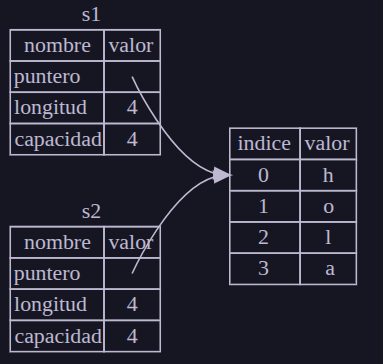

# Ownership
## ¿Que es el Ownership?
Es una de las caracteristicas unicas de Rust a diferencia del resto de los lenguajes.
Gracias al ownership Rust tiene garantias de **seguridad en memoria** sin necesidad de un recolector de basura

El ownership **es un conjunto de reglas que definen como un programa de Rust administra la memoria**.
Todos los programas tienen que administrar la forma en que usan memoria de un computador mientras se ejecutan.
Por ejemplo algunos lenguajes tienen un **recolector de basura (garbage collector)** que busca periodicamente la memoria que ya no se usa mientras el programa esta en ejecucion. En otros lenguajes el programador es quien se encarga de **asignar y liberar memoria explicitamente** (obviamente este ultimo mecanismo es propenso a cometer muchos errores ya que el programador debe saber bien cuando tomar o liberar memoria, como en C).

¿Que mecanismo usa Rust para manejar la memoria? La maneja a traves de un **sistema de OWNERSHIP** con un conjunto de reglas que el compilador Cargo de Rust verifica, si alguna de estas reglas se viola entonces se detectara el error de manejo de memoria en tiempo de compilacion.

La analogia es que el ownership es como **la propiedad de un objeto**, por ejemplo si tenemos un libro entonces EL LIBRO ES NUESTRO. Si se lo presto a alguien el libro sigue siendo nuestro, pero ahora el libro esta en posesion de otra persona. Si el libro me lo devuelven entonces el libro regresa a mi posesion, esta es una analogia perfecta con Ownership

### Stack y Heap
En Rust es importante saber si un valor esta en el **stack** o en el **heap** ya que afecta como el lenguaje se comporta y porque debe tomar ciertas decisiones.

Tanto el stack como el heap son partes de la memoria disponible para nuestro codigo fuente para usar en tiempo de ejecucion, pero el stack y heap tienen estructuras distintas.

- **Stack**: Almacena valores del codigo en orden en que los recibe y elimina los valores en el orden inverso, esto se lo conoce como comportamiento **LIFO: Last In, First Out**, osea tiene comportamiento de **PILA**. Todos los datos almacenados en el stack deben tener un **tamaño fijo conocido**. Los datos con un tamaño desconocido en tiempo de compilacion (por ejemplo cuando usamos una variable con mut) deben almacenarse en el heap en su lugar

- **Heap**: El heap es mas desestructurado y por ende menos organizado que el stack. Cuando colocamos datos en el heap, le tenemos que pedir a la memoria cierta cantidad de espacio (por ejemplo cuando haciamos malloc() en C). El administrador de memoria encuentra un lugar vacio en el heap que sea lo suficientemente grande a lo que nosotros solicitamos y lo marca como en uso y devuelve un puntero que apunta a ese sector de memoria reservado (osea comportamiento de C). Esto ultimo se le llama proceso de asignar en el heap. Debido a que el puntero que apunta a ese pedazo de memoria en el heap tiene un tamaño conocido y fijo, podemos almacenar por ende ese puntero que apunta a un pedazo de memoria del heap en el stack!!!, sin embargo cuando solicitamos los datos reales a los que apunta el puntero estos datos se obtienen del heap.

Empujar datos en el stack es mas rapido que asignar valores en el heap porque el administrador de memoria no tiene que hacer el trabajo de buscar un lugar libre de memoria en el heap para almacenar nuevos datos. En cambio si tenemos variables con tamaño fijo y conocido durante toda la ejecucion del programa entonces el valor de estas variables siempre se almacenan en el Stack en el top de la pila siempre. En comparacion asignar espacio en el heap requiere mucho mas trabajo porque el administrador de memoria debe primero encontrar un espacio lo suficientemente grande para contener los datos con tamaño no fijo y luego realizar tareas administrativas para prepararse para la siguiente asignacion

Acceder a los datos en el heap es generalmente mas lento que acceder a los datos de tamaño fijo en el stack ya que en el caso del heap debemos seguir hacia donde apunta un puntero para acceder al dato en el heap.

Esto de acceder a los datos en el heap y stack es muy influyente en los **procesadores** actuales ya que pensemos el procesador como un mozo de un restaurante que toma pedidos en muchas mesas; Es más eficiente obtener todos los pedidos de una mesa antes de pasar a la siguiente mesa. Tomar un pedido de la mesa A, luego un pedido de la mesa B, luego uno de la A nuevamente y luego uno de la B nuevamente sería un proceso mucho más lento. Del mismo modo, un procesador usualmente puede hacer su trabajo mejor si trabaja con datos que están cerca de otros datos (como lo están en el stack) en lugar de más lejos (como pueden estar en el heap)

Por ejemplo, supongamos que en nuestro programa en ejecucion se llama a una funcion, esa funcion tiene un conjunto de variables de tamaño fijo (cuyos datos se almacenan en el stack) y tambien hay variables dentro del scope de la funcion de tamaño no fijo que se almacenan en el heap pero sus respectivos punteros se almacenan en el stack, entonces cuando se llama a la funcion las variables locales de la funcion se empujan en el stack, luego cuando la funcion termina de ejecutarse esos valores se sacan del stack obviamente siguiendo la logica FIFO/PILA

Mantener un registro de que partes del codigo esta utilizando memoria en el heap, minimizar la cantidad de datos duplicados en el heap y limpiar datos no utilizados en el heap para no quedarnos sin espacio de memoria en el heap son **TODOS PROBLEMAS QUE EL OWNERSHIP DE RUST SOLUCIONA**.

Cuando entendemos como funciona Ownership ya no nos tenemos que preocupar mas en diferenciar los datos que se almacenan en el stack o en el heap como en C. **El principal proposito de ownership es administrar datos en el heap**

### Reglas de Ownership
Siempre que pensemos en Ownership tenemos que pensar en lo siguientes aspectos clave que nos facilitaran entenderlo:

1. **Cada valor en Rust tiene un propietario**
2. **Solo pueden tener un propietario a la vez**
3. **Si el propietario sale del scope entonces el valor muere**

### Ambito de las Variables
Toda variable tiene un contenxto/scope de ejecucion. El **scope** es el rango o espacio dentro de un programa donde el elemento es valido, por ejemplo:

```rust
let s = "hola"; // Variable global, es decir, es valida en todo el scope del programa
```

```rust
// Definimos explicitamente un scope
{ // El scope inicia aca
  let s = "hola"; // Esta variable solo es valida dentro de este scope
} // El scope termina aca

// La variable 's' no es valida aca afuera
```

Cuando la variable *s* esta dentro del scope entonces en todo lugar dentro del scope siempre *s* es valido, pero por fuera del scope ya la variable *s* no es mas valida.

### El tipo String
Hasta ahora trabajamos con tipos de datos simples cuyos tamaños son conocidos por lo que tranquilamente pueden almacenarse en el stack y se sacan del stack cuando su scope termina. Pero queremos ver los datos que se almacenan en el heap y ver como Rust sabe cuando limpiarlo del heap liberando correctamente la memoria. El tipo de dato **String** es ideal ya que es una coleccion por ende su tamaño puede ser modificable.

Nosotros hasta ahora la unica manera que vimos de hacer strings son de la siguiente manera:

```rust
let texto = "Esto es un texto"
```

Sin embargo esto es un **literal de cadena**, osea es **inmutable** logicamente ya que no tiene el mut, pero como hacemos para que sea mutable? Le podemos colocar mut?

```rust
let mut texto = "Esto es un texto" // Esto si funciona

texto = "Otro texto" // Esto funciona

texto[0] = 'x'; // Esto ya no lo podriamos hacer, no podemos modificar el contenido del propio texto
```

Lo en realidad optimo que se usa para hacer cadenas **mutables** es lo que se conoce como **String**, osea:

```rust
let mut texto = String::from("Esto es un texto"); // Esto seria lo correcto
```

El tipo **String** permite crear cadenas **mutables** por lo tanto administra datos asignados en el **heap** y como tal es capaz de almacenar una cantidad de texto que no conocemos en el tiempo de compilacion

> **NOTA IMPORTANTE RELACION MUT CON EL HEAP**: Algo que nosotros habiamos dicho es que el **mut** permite hacer que variables sean mutables, eso quiere decir que al ser mutables entonces estos valores se almacenan en el heap ya que justamente como son mutables eso quiere decir que su contenido se puede modificar por lo tanto su largo se puede modificar no? La respuesta es **NO!!**. Por ejemplo si yo hago:
```rust
let mut x = 2;
```
> Esto ultimo no quiere decir que la variable 'x' al ser mutable entonces 'x' seria como un puntero en el stack que apunta al heap a un segmento de memoria donde esta el valor 2, **NO!**, lo que quiere decir es que sabemos que la variable 'x' siempre es un tipo de dato i32 por lo tanto como ya se conoce de antemano su tamaño entonces el valor 2 se almacena en el **stack**!, y al ser mutable 'x' puede tomar el valor de 93, 12912, 3292, etc. tranquilamente, total todos esos valores siempre son i32 por lo tanto como todos son i32 entonces siempre le corresponde a la variable 'x' los mismos bloques de memoria sin alterarse, por lo tanto es por ello que el valor de la variable 'x' siempre vive en el stack ya que siempre es un tipo de dato i32 por lo tanto siempre va a necesitar el mismo espacio en memoria por lo tanto el valor de 'x' siempre se almacena en el stack.

> Solo cuando el tamaño es desconocido (como String de largo dinamico) Rust usa el **HEAP** y almacena un puntero en el stack que apunta a esa ubicacion de memoria en el heap. 

Entonces volviendo a lo de la String eso quiere decir que ahora una variable que es de tipo String puede ser de largo dinamico ya que ahora el valor de la variable de tipo String vive en el heap:

```rust
let mut s = String::from("hola"); // Obviamente tiene que ser mut porque el valor de la variable 's' es mutable, pero ademas como es de tipo String esto quiere decir que ahora 's' es un puntero que vive en el stack que apunta hacia bloques de memoria del heap donde esta el valor "hola"

// Por lo tanto el largo (hablando en terminos de bits) del valor de la variable 's' se puede modificar, por ejemplo podemos agregarle mas caracteres al final
s.push_str(", mundo!") // Ahora el valor de la variable 's' seria "hola, mundo!" que vive en el heap
```

### Memoria y Asignacion
En resumidas el tipo **String** nos permite ademas hacer que la extensibilidad del texto sea dinamica (cosa que no podiamos con el *mut*)

Cuando usamos el tipo String obviamente como usa el heap entonces necesitamos asignar una cantidad de memoria en el heap desconocida en tiempo de compilacion para que justamente ese sector de memoria reservado en el heap pueda contener el contenido, esto significa:

- La memoria debe solicitarse en tiempo de ejecucion
- Necesitamos una forma de devolverle la memoria reservada al administrador de memoria cuando terminemos de usar dicho sector de memoria en el heap para que el administrador pueda liberarla

La primera parte la hacemos nosotros cuando usamos **String::from** donde en tiempo de ejecucion se solicita una cantidad de memoria en el heap para usarse

Para la segunda parte aca es donde los lenguajes de programacion hacen cosas distintas para **liberar la memoria**, algunos implementan el Liberador de Basura (**Garbage Collector**) donde este recolector de basura rastrea y limpia la memoria que ya no se esta usando.

En caso de que en otros lenguajes no tengan recolector de basura (como en C) entonces es responsabilidad del propio programador identificar cuando la memoria ya no se esta usando y llamar al codigo para liberarla (recordar la funcion free() de C)

En resumidas cuentas necesitamos **emparejar una asignacion de memoria con su respectiva liberacion en el momento adecuado**

Rust toma esto ultimo y hace un camino diferente sin usar Garbage Collector. La cuestion es que la memoria se libera **automaticamente** una vez que la variable que la posee **SALE DEL SCOPE**, veamos:

```rust
// Abrimos un scope
{
  let s = String::from("hola"); // La variable 's' es valida dentro del scope

  // Aca adentro podemos hacer cualquier cosa con 's', el valor de 's' sigue estando en el heap
}

// Ya aca afuera la variable 's' no vive mas por ende la memoria que habia reservado en el heap se libera AUTOMATICAMENTE
```

Este ultimo mecanismo es el que implementa Rust!, basicamente en la llave de cierre **Rust llama automaticamente la funcion drop() para liberar la memoria**

### Variables y datos interactuando con Move
Varias variables pueden interactuar con los mismos datos de diferentes formas en Rust. Veamos un ejemplo:
```rust
let x = 5;
let y = x;
```

Primero vinculamos el valor 5 a 'x', y luego hacemos una copia de ese valor vinculandolo a 'y'. Ahora tenemos 2 variables 'x' e 'y' y ambos valen 5. Sabemos que ambas variables tienen un tamaño fijo y conocido por lo tanto es logico que los valores 5 de ambas variables se empujan a una **pila (stack)**

Ahora veamos el siguiente caso:
```rust
let s1 = String::from("hola");
let s2 = s1;
```

Podemos pensar que pasa exactamente lo mismo que antes pero no y esto es porque usamos **String**. El tipo String esta compuesto por 3 partes:

- **Puntero**: Un puntero a la memoria que contiene el contenido de la cadena
- **Longitud**: Cuanta memoria, en bytes, los contenidos del String estan utilizando actualmente
- **Capacidad**: Cantidad total de memoria, en bytes, que el String ha recibido del administrador.

Entonces cuando asignamos *s1* y *s2* a los datos de String se copian, lo que significa que copiamos todo, es decir, el puntero, la capacidad y la longitud que estan en la pila. Osea no copiamos los datos en el heap al que hace referencia el puntero. Osea lo que se copiaria para las 2 variables seria lo siguiente:


Ahora bien, si Rust tambien copiara los datos en el Heap (cosa que no lo hace por temas de rendimiento) entonces logicamente se veria asi:


Ahora bien, nosotros dijimos que cuando una variable sale del scope entonces Rust llama automaticamente a la funcion **drop()** para limpiar la memoria del heap para esa variable. Ahora bien, lo cierto es que para las variables *s1* y *s2* apuntan al mismo bloque en el heap, osea ambos punteros apuntan al mismo lugar y esto es un problema ya que si *s1* y *s2* salen del scope entonces haran una liberacion doble para el mismo bloque de memoria en el heap, a esto se le llama **liberacion doble** y es uno de los errores en seguridad de memoria. Liberariamos la memoria 2 veces cosa que conduciria a la corrupcion de memoria y esto conduce a vulnerabilidades en seguridad.

Para garantizar que esto ultimo no suceda lo que hace Rust es que despues de la linea *let s2 = s1* Rust ahora considera que *s1* como **no valida** por lo tanto al considerarla automaticamente como no valida ahora no es necesario que se libere *s1* cuando sale del scope. Por lo tanto:
```rust
let s1 = String::from("hola");
let s2 = s1;

println!("{s1}, mundo!"); // Esto romperia ya que 's1' ya no es mas valido
```

Es decir ya *s1* no es mas valido. Y aca es cuando aparecen los conceptos de **copia superficial** y **copia profunda**.

La **Copia Superficial** es cuando se copia el puntero, longitud y capacidad sin copiar los datos en el heap, osea lo siguiente que vimos


Sin embargo como Rust por defecto invalida la primer variable entonces esto se lo conoce como **movimiento**, osea:


Entonces teniendo este **movimiento** entonces ahora solo la variable *s2* seria valida y cuando sale del scope entonces solo se liberiaria *s2* ya que ahora *s1* no es mas valida.

Otra cosa importante es que **Rust NUNCA CREARA COPIAS PROFUNDAS** en nuestros datos, osea nunca hara lo siguiente:


### Alcance y Asignacion
Veamos el siguiente codigo de ejemplo:

```rust
let mut s = String::from("hola");
s = String::from("ahoy");

println!("{s}, mundo!");
```

Inicialmente declaramos la variable *s* y la vinculamos a un *String* con el valor de *"hola"*. Luego inmediatamente creamos un nuevo String con el valor *"ahoy"* y lo asignamos a *s*. Entonces aca tambien actuaria el efecto de **movimiento** de Rust y nos quedaria asi:


Es decir, el valor inicial de *s* ha sido completamente reemplazado, lo que hace Rust es al valor inicial librerarlo automaticamente llamando a *Drop()* y la memoria del primer valor sera liberado inmediatamente. Entonces cuando imprimimos el valor final sera *"ahoy, mundo!"*

### Variables y Datos interactuando con Clone
Ok, entonces ya vimos que por defecto Rust hace el efecto de **movimiento** al hacer copias de datos pero ¿Y si queremos hacer **copias profundas**?

Si queremos copiar profundamente los datos del heap de la String, no solo los datos de la pila (puntero, capacidad, longitud) podemos usar el metodo llamado **clone**.

```rust
let s1 = String::from("hola");
let s2 = s1.clone();

println!("s1 = {s1}, s2 = {s2}");
```

Aca si fuciona bien y estamos haciendo una copia profunda, osea:


Aca vemos que los datos en el heap **SE COPIAN**

Hay otro problema y es lo siguiente:

```rust
    let x = 5;
    let y = x;

    println!("x = {x}, y = {y}");
```

En este ultimo ejemplo estamos usando simplemente enteros. Este ejemplo parece contradecir lo que acabamos de estudiar, no tenemos una llamada a Clone sin embargo aca sucedio una copia profunda, es decir, *x* sigue siendo valida y no sucedio nada de movimiento.

Esto es obvio, y es porque al ser **ENTEROS** tienen un **TAMAÑO FIJO** a diferencia de las Strings por lo tanto **SE ALMACENA EN EL STACK/PILA** por lo que hacer una copia de estos valores que se almacenan en stack se hace relativamente rapido y por defecto logicamente es copia profunda. Osea en este caso donde el tamaño es conocido no hay razon para hacer que *x* deje de ser valida ya que al estar en el stack no hay nada de memoria que liberar. Osea en este ultimo ejemplo **no hay distincion entre copia superficial y profunda**. Entonces llamar a clone cuando se trata de enteros logicamente no tendria sentido.

Rust tiene una anotacion especial llamada **Copy** que podemos usar en aquellos tipos de datos que se almacenan en el stack como enteros. Si un tipo de dato implementa el trait **Copy** (hablaremos de los traits en cap 10) las variables que lo usan no se mueven, sino que se copia trivialmente haciendo que sigan siendo validas despues de asignarlas a otra variable.

Rust por seguridad no nos permite anotar el tipo de dato con **Copy** si el tipo o cualquiera de sus partes ha implementado el trait **Drop**

Entonces que tipos de datos implementan el trait Copy? En general cualquier valor escalar lo implementa, y nada que requiera asignacion puede implementar Copy. En general los tipos que implementan Copy son logicamente todos tipos de datos que se almacenan en pila/stack que son:

- Todos los tipos de enteros ej: u32
- El tipo booleano bool
- Todos los tipos de punto flotante como f32
- El tipo caracter char
- Tuplas si internamente tambien contiene tipos que tambien implementan Copy como (i32, u32) en cambio (i32, String) no lo implementa.

### Propiedad y Funciones
Las mecanicas de pasar un valor a una funcion son similares a las de asignar un valor a una variable. Veamos un ejemplo:

```rust
fn main() {
    let s = String::from("hola");  // s aparece en el scope principal

    tomar_ownership(s);             // El valor de s se mueve a la función...
                                    // ... y ya no es valido en este scope

    let x = 5;                      // x aparece en el scope principal

    hacer_una_copia(x);             // x deberia moverse a la función,
                                    // pero i32 implementa Copy, entonces es
    println!("{x}");                // valido aún despues de llamar a la función

} // Aquí termina el ámbito, x es destruido con drop. La memoria es liberada.
  // s ya no existia porque habia sido movido a la función.
  // Nada especial ocurre.

fn tomar_ownership(un_string: String) { // un_string aparece en el ámbito
    println!("{un_string}");
} // Aquí termina el ámbito, un_string es destruido con drop. 
  // La memoria es liberada.

fn hacer_una_copia(un_entero: i32) { // un_entero aparece en el ámbito
    println!("{un_entero}");
} // Aquí termina el ámbito, un_entero es destruido. Nada especial ocurre.
```

### Valores de Retorno y Alcance
Los valores de retorno tambien pueden transferir la propiedad (ownership). Veamos un ejemplo de una funcion que devuelve un valor:

```rust
fn main() {
    let s1 = da_un_ownership();         // da_un_ownership es llamado y
                                        // devuelve el valor de retorno
                                        // a s1

    let s2 = String::from("hola");     // s2 aparece en el scope

    let s3 = toma_y_devuelve(s2);  // s2 es movido a la función
                                        // toma_y_devuelve, que también
                                        // retorna el valor de s2 a s3
} // Fin el ámbito, s3 es destruido con drop y se libera la memoria. 
  // s2 fue movido previamente, entonces no pasa nada. 
  // s1 es destruido con drop y se libera la memoria.

fn da_un_ownership() -> String {             // da_un_ownership mueve su
                                             // retorno a la función que la
                                             // llama

    let un_string = String::from("tuyo");    // un_string aparece en el ámbito

    un_string                                // un_string es retornado y
                                             // mueve su valor
}

// Esta función toma un String y devuelve uno
fn toma_y_devuelve(un_string: String) -> String { // un_string aparece 
                                                  // en el ámbito

    un_string  // un_string es retornado y mueve su valor
}
```

Cuando una variable que incluye datos en el heap sale del scope el valor se limpia por Drop() a menos que la propiedad de los datos se haya movido a otra variable.

Aunque este ultimo ejemplo de codigo funciona tomar el ownership y luego devolverla con cada funcion es un poco tedioso ¿Que hacemos si queremos que la funcion simplemente tome el valor pero no el ownership de la variable? Es bastante molesto que todo lo que pasamos a la funcion necesite volver a pasar si queremos usarlo de nuevo. Rust nos permite devolver multiples valores usando una tupla asi:

```rust
fn main() {
    let s1 = String::from("hola");

    let (s2, len) = calcular_longitud(s1);

    println!("La longitud de '{s2}' es {len}.");
}

fn calcular_longitud(s: String) -> (String, usize) {
    let length = s.len(); // len() retorna la longitud de un String

    (s, length)
}
```

Ahora bien entonces volviendo a lo que dijimos antes ¿Que hacemos si queremos que la funcion simplemente tome el valor pero no el ownership de la variable? Y es aca donde entra el concepto de **REFERENCIAS** que sirve para **usar un valor sin transferir el ownership**

