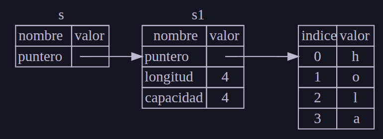

# Referencias y Prestamos
Vamos a arrancar en lo ultimo que vimos sobre que siempre se pasa el ownership de funcion en funcion y esto es un problema, es por ello que para no pasar siempre el ownership de una variable existe el concepto de **referencias**. Una **referencia** es como un puntero (**OJO, NO ES UN PUNTERO**) en que es una direccion que podemos seguir para acceder a los datos almacenados en esa direccion, esos datos siguen siendo propiedad de la otra variable. A diferencia de un puntero, una referencia garantiza que apunte a un valor valido de un tipo particular para la vida de esa referencia.

Veamos un ejemplo:

```rust
fn main(){
  let s1 = String::from("hola");
  let len = calcular_longitud(&s1); // Aca pasamos referencia a la variable 's1', por lo tanto la funcion recibe el VALOR, no el ownership
}

fn calcular_longitud(s: &String) -> usize { // La funcion recibe una referencia a un String
  s.len()
} // Aca la referencia 's' sale del scope, pero como 's' no tiene ownership sino que 's' es solo un PRESTAMO, no se destruye al salir del scope. se regresa al propietario s1
```

Vemos que la funcion *calcular_longitud* recibe como parametro una referencia al tipo de dato String. La referencia nos permite referirnos a algun valor sin tomar el ownership del mismo. Lo que sucedio es conceptualmente lo siguiente:



Es decir, la referencia se almacena en el stack/pila y apunta hacia la variable *s1* (que se almacena tambien en pila/stack) que recordemos que la variable *s1* tiene los campos puntero, longitud y capacidad ya que es un String, y el valor al que apunta la variable *s1* es logicamente un tipo de dato String que se almacena en heap/cola.

> **NOTA**: Lo opuesto a referenciar (&) es su opuesto que es (*) donde seria la **desreferencia**, basicamente hace el proceso inverso y mas adelante lo veremos

Entonces basicamente la sintaxis *&s1* nos permite crear una **referencia** que que se refiere al valor de *s1* pero **SIN SER EL OWNERSHIP**. Como la referencia entonces no es ownership del valor entonces el valor a la que apunta no se descartara si la referencia deja de usarse.

Cuando las funciones tienen referencias como parametos en lugar de valores reales entonces no necesita devolver los valores para devolver la propiedad ya que nunca tuvimos la propiedad/ownership

La accion de crearle una referencia a una variable se le llama **borrowing** ('prestar' en ingles). Como en la vida real, si una persona posee algo, podemos pedirlo prestado y cuando terminemos tenemos que devolverlo.

¿Que pasa si intentamos modificar algo que estamos prestando? Veamos el sig. codigo ejemplo:

```rust
fn main() {
    let s = String::from("hola");

    modificar(&s);
}

fn modificar(un_string: &String) {
    un_string.push_str(", mundo");
}
```

En este caso estamos intentando modificar una referencia pero ojo porque al igual que las variables **LAS REFERENCIAS POR DEFECTO SON INMUTABLES**, osea no por nada dijimos que las referencias se guardan tambien en pila/stack. **RUST NO PERMITE MODIFICAR UNA REFERENCIA**

## Referencias Mutables
Lo ultimo no quiere decir que no haya referencias mutables, existen, pero tenemos que indicarlo explicitamente. Las referencias mutables logicamente sirven para modificar un valor prestado, osea:

```rust
fn main() {
  let mut s = String::from("hola");

  modificar(&mut s);
}

fn modificar(un_string: &mut String) {
  un_string.push_str(", mundo");
}
```

Logicamente primero la variable *s* pasa ser mutable (mut) para permitir que se modifique el valor de la variable almacenada en heap. Luego creamos una referencia mutable *&mut s* donde llamamos a la funcion *modificar* y definimos que en la firma de la funcion recibe referencias mutables hacia String.

Sin embargo las referencias mutables tienen una gran restriccion que son: **SI tenemos una referencia mutable a un valor entonces no podemos tener otras referencias a ese valor** veamos un ejemplo:

```rust
let mut s = String::from("hola");

let r1 = &mut s;
let r2 = &mut s; // Este fallara ya que creamos una segunda referencia mutable a la variable 's'

println!("{r1}, {r2}");
```

La restriccion que impide multiples referencias mutables a los mismos datos al mismo tiempo permite la mutacion pero de una manera controlada. El beneficio de tener esta restriccion es logico **que Rust pueda prevenir las carreras de datos en tiempo de compilacion**. Las carreras de datos son muy similares a las condiciones de carrera y ocurren cuand se dan estos 3 comportamientos:

1. 2 o mas punteros acceden a los mismos datos al mismo tiempo
2. Al menos uno de los punteros se usa para escribir datos
3. No hay mecanismo usado para sincronizar el acceso a los datos multireferenciados.

Es decir, las carreras de datos son basicamente lo mismo que las condiciones de carrera y es cuando se quiere acceder al mismo tiempo a un recurso compartido mediante el uso de punteros. Las carreras de datos causan un comportamiento indefinido y son dificiles de diagnosticar y corregir cuando intentamos rastrearlas en tiempo de ejecucion, es por ello que directamente Rust las evita negandose a compilar condigo que tenga carreras de datos

En su lugar podemos usar llaves para definir scopes y aca si podemos definir multiples referencias mutables c/u en su respectivo scope:

```rust
let mut s = String::from("hola");

{
  let r1 = &mut s;
} // r1 sale de su scope aca, por lo fuera del scope no hay problema si creamos otra referencia mutable

let r2 = &mut s; // Aca si es valido ya que esta en scope distinto
```

Otra restriccion que hay en Rust tambien por carrera de datos es que no podemos tener una referencia mutable en la misma scope tambien habiendo otra referencia, es decir:

```rust
let mut s = String::from("hola");

let r1 = &s; // Esto lo hace bien, referencia comun
let r2 = &s; // Esto tambien lo hace bien, es otra referencia que es admitida en el mismo scope ya que no es mutable por ende no modifica el valor al que apunta por tanto teniendo varias referencias comunes en el mismo scope no genera carrera de datos

let r3 = &mut s; // Aca viene ya el problema con esta referencia mutable 
```

Es decir, tampoco podemos tener referencias mutables mientras tenemos referencias inmutables al mismo valor.

Los de referencia inmutable no esperan que el valor cambie repentinamente debajo de ellos, sin embargo se permiten multiples referencias inmutables porque nadie que solo esta leyendo los datos tiene la capacidad de afectar la lectura de los datos de nadie mas.

Una cosa clave que tenemos que tener en cuenta es que **el scope de una referencia arranca desde donde se introduce y continua hasta la ultima vez que se usa dicha referencia**, veamos un ejemplo:

```rust
let mut s = String::from("hello");

let r1 = &s; // No hay problema
let r2 = &s; // No hay problema
println!("{r1} y {r2}");
// A partir de aca las referencias r1 y r2 no se usan mas por lo tanto aca es como si nunca hubieran existido

let r3 = &mut s; // No hay problema
println!("{r3}");

```

El scope de las referencias *r1* y *r2* terminan despues del *println!* donde se usan las referencias por ultima vez que es antes de que se cree la referencia mutable *r3*

Aunque todas estas restricciones y errores respecto a **prestamos** a veces pueden ser frustrantes recordemos que es el compilador de Rust que nos protege y nos señala un error potencial temprano (en tiempo de compilacion en lugar en tiempo de ejecucion) y nos muestra exactamente donde esta el problema, esto por ejemplo en C olvidemonos que existe, en C es totalmente libre todo y por lo tanto se pueden cometer muchas cagadas. Entonces gracias al compilador de Rust no tenemos que estar rastreando porque nuestros datos son lo que no esperabamos que sean

## Referencias Colgantes
En lenguajes con punteros (como en C) es facil crear **accidentalmente un puntero colgante**. Un puntero colgante seria basicamente un puntero que apunta a un valor que ya no es valido. Por ejemplo, si tenemos una funcion que devuelve un puntero a una variable local de la funcion, cuando la funcion termina, la variable local se destruye y el puntero queda colgando apuntando a un lugar de memoria que ya no es valido. Por ejemplo:

```rust
fn main() {
  let referencia_a_la_nada = colgar(); // La variable 'referencia_a_la_nada' referencia a la nada misma
}

fn colgar() -> &String {
  let s = String::from("hola");
  &s // Aca estamos retornando una referencia a una variable local del scope que se destruye al salir de la funcion, por lo tanto la referencia queda colgando
} // Aca 's' sale del scope y se libera su memoria sin embargo retornamos una referencia a la memoria destruida!, osea retornamos una referencia a una memoria que no existe mas!
```

Como lo solucionariamos? Bueno lo que tendriamos que hacer es que en su lugar la funcion *colgar* devuelva directamente el string si volver ninguna referencia a ella, osea:

```rust
fn no_colgante() -> String {
  let s = String::from("hola");
  s // Aca retornamos el String directamente, no una referencia a el, por lo tanto no hay problema de referencias colgantes ya que el ownership del String se transfiere a la variable que llama a la funcion
}
```

