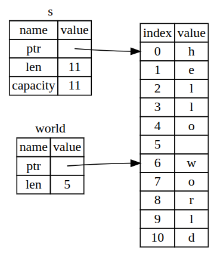

# El tipo Slice
El slice nos permite referenciar a una **secuencia contigua** de elementos en una coleccion en lugar de una coleccion completa como veniamos haciendo hasta el momento con las referencias comunes y corrientes.

Un slice es como un tipo de referencia por lo tanto al igual que las referencias **tampoco tienen ownership**.

Entonces **un string slice es una referencia a una secuencia contigua de elementos de una coleccion**, codigo de ejemplo:

```rust
let s = String::from("hello world");

let hello = &s[0..5];
let world = &s[6..11];
```

Osea *hello* y *world* son referencias, pero en lugar de referenciar todo el *String* son referencias a porciones de la coleccion.

Internamente la estructura de datos del Slice almacena la posicion inicial y la longitud del slice. Por lo tanto por ejemplo en *let world = &s[6..11]* seria un slice que contiene un puntero al byte en el indice 6 de la string *s* con un valor de longitud 5

Si lo vemos en un diagrama los 2 slices referenciando al String en el heap seria asi:



Hagamos un ejercicio sabiendo ahora lo que son slices, el objetivo es retornar un slice apuntando a la primer palabra de una frase, por ejemplo si la frase es "hola como estas" entonces el slice deberia ser una referencia al "hola", entonces esto se haria asi:

```rust
fn first_world(s: &String) -> &str { // La funcion recibe una referencia a una String y retorna un slice a un caracter
  let bytes = s.as_bytes(); // Pasamos el string a bytes

  // Iteramos con un enumerador, el primer elemento es el indice y el segundo una referencia a cada caracter
  for (i, &item) in bytes.iter().enumerate() {
    // Si el byte es espacio entonces retornamos el slice desde el indice 0 hasta la posicion del indice donde esta el caracter espacio
    if item == b' ' {
      return &s[0..i];
    }
  }

  // Retornamos un slice que apunta al primer caracter de la primer palabra de la frase
  &s[..]
}
```

## String Literales como Slices
Recordemos que hablamos sobre que los strings literales se almacenan en el binario del programa y que son inmutables, entonces los strings literales son slices de string! Osea:

```rust
let s = "hello world"; // Esto es un string literal, por lo tanto es un slice de string

// Es decir, el tipo de s es &str, un slice de string, y no String como podriamos pensar. Es un slice apuntando a ese punto especifico del binario. Esto tambien es porque los literales de string son INMUTABLES osea justamente al ser un tipo de dato &str es una referencia a un string literal que es inmutable, por lo tanto no podemos modificarlo. Si quisieramos modificarlo tendriamos que convertirlo a String y ahi si podriamos modificarlo.
```

Entonces los un rustacean mas experimentado escribiria la firma en su lugar de la funcion *first_world* asi:

```rust
fn first_world(s: &str) -> &str { // La funcion recibe un slice de string y retorna un slice a un caracter
```

Definir una funcion para tomar un string slice en lugar de una referencia a un String hace que nuestra API sea mas flexible ya que podemos pasarle tanto un String como un string literal, ya que ambos **SE LOS CONSIDERA SLICES DE STRING**.

Entonces ahora la funcion first_world funciona tanto con slices de string sean parciales o completos por ejemplo:

```rust
fn main() {
  let my_string = String::from("hello world");

  // first_word funciona con slices de string sean parciales o completos
  let word = first_world(&my_string[0..6]); // Pasando un slice de string parcial

  let word = first_world(&my_string[..]); // Pasando un slice de string completo

  let my_string_literal = "hello world";

  // Tambien first_word funciona con slices de string literales sean parciales o completos
  let word = first_world(&my_string_literal[0..6]); // Pasando un slice de string literal parcial

  let word = first_world(&my_string_literal[..]); // Pasando un slice de string literal completo

  // Tambien como los string literals son slices de String esto tambien podria funcionar
  let word = first_world(my_string_literal); // Pasando un string literal directamente
}
```

Es decir, de todas estas maneras de llamar a la funcion first_world todas son validas y funcionan correctamente, ya que la funcion esta definida para recibir un slice de string, y tanto los slices de string como los string literales son slices de string.

## Otros Slices
Ya vimos los string slices que logicamente son especificas para strings, pero hay otro tipo de slices mas general:

```rust
  let arr = [1, 2, 3, 4, 5];
  let slice = &arr[1..4]; // Esto es un slice de un array
```

Este slice tiene el tipo de dato &[i32], osea un slice de enteros, y funciona exactamente igual que los string slices, es decir, es una referencia al primer elemento del slice y tiene un valor de longitud que indica cuantos elementos tiene el slice. En este caso el slice contiene los elementos 2, 3 y 4 del array original.
