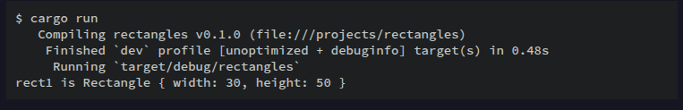

> NOTA: Leer luego del codigo main.rs

## Añadiendo funcionalidad Util con Traits Derivados
Seria util poder imprimir una instancia de Rectangle mientras estamos depurando nuestro programa y ver los valores de todos sus campos. Por ejemplo veamos el sig. codigo para tratar de imprimir una instancia Rectangle:

```rust
struct Rectangle {
  width: u32,
  height: u32,
}

fn main() {
  let rect1 = Rectangle {
    width: 30,
    height: 50,
  };

  println!("rect1 is {}", rect1); // Esto no compila porque no podemos imprimir una instancia de Rectangle ya que no sabemos que deberia imprimir
}
```

La macro *println!* puede hacer muchos tipos de formateo, y por defecto, las llaves curvas le dicen a println! que use el formateo conocido como **Display**, osea salida destinada al consumo directo del usuario final. Los tipos de datos primitivos como u32, String, etc. implementan el trait Display por defecto ya que si por ejemplo el valor de una variable u32 es 5 entonces solo hay una manera de mostrarle ese 5 al usuario final. Pero para las structs? Hay varias maneras de mostrar una struct a un usuario por lo tanto println! no sabria que mostrarle. Debido a esa ambiguedad Rust no intenta adivinar lo que queremos y **las estructuras no tienen una implementacion proporcionada de Display** para usar con println! y el marcador de posicion {}.

Lo que podriamos hacer para mostrar la instancia Rectangle al usuario final seria lo siguiente:

```rust
struct Rectangle {
  width: u32,
  height: u32,
}

fn main() {
  let rect1 = Rectangle {
    width: 30,
    height: 50,
  };

  println!("rect1 es {rect1:?}"); // Poner el signo de interrogacion despues de los dos puntos le dice a println! que use el formateo conocido como **Debug**. El rasgo Debug nos permite imprimir nuestra estructura de una menra que sea util para los desarrolladores para que podamos visualizar su valor mientras depuramos nuestro codigo
}
```

Sin embargo al compilar el codigo seguira tirando error. Para solucionarlo, necesitamos derivar el trait Debug para nuestra struct. Esto se hace agregando la anotacion #[derive(Debug)] antes de la definicion de la struct. Esto en codigo seria asi:

```rust
#[derive(Debug)] // Derivamos el trait Debug para nuestra struct Rectangle. Esto le dice a Rust que queremos que la struct implemente el trait Debug y nos permite usar el formateo Debug con println!
struct Rectangle {
  width: u32,
  height: u32,
}

fn main() {
  let rect1 = Rectangle {
    width: 30,
    height: 50,
  };

  println!("rect1 es {rect1:?}"); // Ahora si compila y podemos ver el valor de la instancia Rectangle mientras depuramos nuestro codigo
}
```

Entonces ahora cuando compilamos el codigo no obtenemos ningun error sino que veremos algo asi:



No es la salida mas bonita pero muestra los valores de todos los campos de esa instancia, lo que definitivamente ayudaria en la depuracion. Cuando tenemos estructuras de codigo mas grandes es util tener una salida que sea un poco mas facil de leer, en esos casos podemos usar *{:#?}* en lugar de *{:?}* para que la salida sea mas legible. Por ejemplo:

```rust
#[derive(Debug)]
struct Rectangle {
  width: u32,
  height: u32,
}

fn main() {
  let rect1 = Rectangle {
    width: 30,
    height: 50,
  };

  println!("rect1 es {rect1:#?}"); // Usamos {:#?} para una salida mas legible
}
```

Entonces la salida en este caso seria asi:


Tambien otra alternativa de imprimir usando el formato Debug es usar la macro *dbg!*. Esta macro imprime el valor de la expresion que le pasamos y tambien nos dice en que linea de codigo se encuentra esa expresion. Por ejemplo:

```rust
#[derive(Debug)]
struct Rectangle {
  width: u32,
  height: u32,
}

fn main() {
  let scale = 2;
  let rect1 = Rectangle {
    width: dbg!(30 * scale), // Imprime el valor de la expresion y la linea de codigo donde se encuentra
    height: 50,
  };

  dbg!(&rect1); // Imprime el valor de la expresion y la linea de codigo donde se encuentra
}
```

Entonces la salida seria algo asi:


