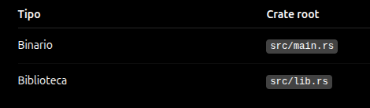

A medida que escribimos programas mas grandes organizar el codigo se vuelve mas importante. Al agrupar funcionalidades relacionadas y separar el código con características distintas, tendrás más claro dónde encontrar el código que implementa una característica concreta y dónde ir para cambiar el funcionamiento de una característica.

Los programas que hemos escrito hasta ahora han estado en un módulo en un archivo. A medida que un proyecto crece, debes organizar el código dividiéndolo en múltiples módulos y luego en múltiples archivos

Un paquete puede contener múltiples crates binarios y opcionalmente un crate de biblioteca. A medida que un paquete crece, puedes extraer partes en crates separados que se convierten en dependencias externas. Para proyectos muy grandes que comprenden un conjunto de paquetes interrelacionados que evolucionan juntos, Cargo proporciona **workspaces** que veremos mas adelante.

También discutiremos la encapsulación de detalles de implementación, que le permite reutilizar el código a un nivel superior: una vez que ha implementado una operación, otro código puede llamar a su código a través de su interfaz pública sin tener que saber cómo funciona la implementación. La forma en que escribes el código define qué partes son públicas para que otro código las use y qué partes son detalles de implementación privados que te reservas el derecho de cambiar.

Un concepto relacionado es el **ámbito**: el contexto anidado en el que se escribe el código tiene un conjunto de nombres que se definen como "en el ámbito". Al leer, escribir y compilar código, los programadores y compiladores necesitan saber si un nombre concreto en un punto determinado se refiere a una variable, función, estructura, enumeración, módulo, constante u otro elemento, y qué significa ese elemento. Se pueden crear ámbitos y cambiar los nombres que están dentro o fuera de ellos. No puede haber dos elementos con el mismo nombre en el mismo ámbito; existen herramientas para resolver conflictos de nombres.

Rust tiene una serie de características que te permiten administrar la organización de tu código, incluidos los detalles que se exponen, los detalles que son privados y los nombres que están en cada ámbito en tus programas. Estas características, a veces denominadas colectivamente **sistema de módulos**, incluyen:

- **Paquetes**: Una caracteristica de Cargo que te permite consturir, probar y compartir crates. Un paquete contiene un archivo Cargo.toml y puede contener uno o más crates.

- **Crates**: Un crate es un árbol de módulos que produce un binario o una biblioteca. Un crate puede ser binario o de biblioteca. Un crate binario es un programa ejecutable, mientras que un crate de biblioteca contiene código que otros crates pueden usar como dependencia.

- **Modulos y use**: Te permiten organizar el código en módulos y submódulos, y controlar qué partes del código son accesibles desde otros módulos.

- **Rutas**: Un sistema de rutas que te permite referenciar elementos en tu código, ya sea dentro del mismo crate o en crates externos.

## Crates
Un Crate es **la unidad mas pequeña de codigo que el compilador de Rust considera como una unidad**. Podemos pensar la estructura de un paquete asi:

```
PACKAGE
│
├── CRATE BINARIO
│   └── main.rs
│
├── CRATE DE BIBLIOTECA
│   └── lib.rs
│
└── otros crates binarios
    ├── bin/a.rs
    └── bin/b.rs
```

Como vemos tenemos distintos tipos de crates, entonces un crate es una unidad de codigo que Rust compila como una unidad. Por ejemplo supongamos que en un archivo *main.rs* tenemos:

```rust
fn main() {
    println!("Hola mundo");
}
```

Si lo compilamos directamente con `rustc main.rs` obtendremos un ejecutable llamado *main* que contiene el crate binario. Rust justamente considera a *main.rs* como un **crate binario**

Algo importante es que un crate puede contener **modulos**, osea:

```
crate
│
├── módulo A
│
├── módulo B
│
└── módulo C
```

Mas adelante veremos que son los modulos en un crate.

Entonces como dijimos hay 2 tipos de crates que son **Crates binarios** y **Crates de biblioteca**, el que nosotros acabamos de compilar seria un crate binario.

El **Crate Binario** es basicamente un programa que puede convertirse en ejecutable por lo tanto si o si dentro debe existir una funcion `main` que es el punto de entrada del programa. Justamente esa funcion main() indica **donde comienza la ejecucion del programa**. Por ejemplo cuando creamos un nuevo proyecto en Rust haciendo `cargo new mi_programa` se crea un crate binario con un archivo *main.rs* que contiene la funcion main() por defecto donde la estructura del proyecto es asi:

```
mi_programa/
├── Cargo.toml
└── src/
    └── main.rs // Crate binario
```

Luego por otro lado esta el **Crate de Biblioteca** donde este no tiene la funcion main() ya que no pretende ser un programa ejecutable por si mismo. Su objetivo es **proporcionar funcionalidad que otros programas puedan utilizar**, justamente es una libreria/biblioteca prporcionandonos herramientas.

Por ejemplo un crate de biblioteca muy famoso es el **rand** que nos permite generar numeros aleatorios. Por ejemplo en nuestro crate binario podemos usar la libreria rand (crate de biblioteca) de la siguiente manera:

```rust
use rand::Rng; // Usamos el crate de biblioteca rand precisamente el modulo Rng que nos permite generar numeros aleatorios

fn main() {
  let numero = rand::thread_rng().gen_range(1..10);
  println!("{}", numero);
}
```

Entonces nuestro programa que es un crate binarios esta usando un crate de biblioteca que es rand.

Por otro lado esta el concepto de **Crate Root** que es el archivo fuente desde el cual Rust comienza a construir el crate. Para un proyecto recien creado con `cargo new` el crate root es *main.rs* para un crate binario.

Mientras que en una biblioteca el crate root es *lib.rs* osea:

```
src/
└── lib.rs // Este es el crate root de un crate de biblioteca
```

Entonces resumiendo:



## Paquetes
Luego por otro lado esta el concepto de **Paquetes/Package** donde **Es un conjunto de uno o mas crates** que ademas tiene incluido el *Cargo.toml* que es el archivo de configuracion del paquete. Por ejemplo cuando creamos un proyecto con `cargo new` se crea un paquete que contiene un crate binario y el archivo Cargo.toml.

```
mi-proyecto/ // Este seria nuestro paquete que puede estar compuesto por uno o mas crates, en este caso tiene un crate binario que a su vez es un crate root y el archivo Cargo.toml que es el archivo de configuracion del paquete
│
├── Cargo.toml
│
└── src/
    └── main.rs
```

Entonces es un grave error pensar que Crate y Package es lo mismo **NO SON LO MISMO**, son conceptos diferentes

Por otro lado como un Package es un conjunto de uno o mas crates entonces podriamos por ejemplo tener un Package que este compuesto por un Crate Binario y ademas un Crate de Biblioteca asi:

```
mi-proyecto/
│
├── Cargo.toml
│
└── src/
    ├── main.rs // Crate Binario
    └── lib.rs // Crate de Biblioteca
```

Puede haber varios crates binarios dentro de un paquete? Si, por ejemplo podriamos tener un package con la sig. estructura:

```
mi-proyecto/
│
├── Cargo.toml
│
└── src/
    ├── main.rs // Crate binario
    │
    └── bin/
        ├── servidor.rs // Crate binario
        └── cliente.rs // Crate binario
```

Sin embargo hay una regla importante que cumplir dentro de los paquetes y es que **un paquete puede contener como maximo un crate de biblioteca**. No se pueden tener 2 o mas crates de biblioteca dentro de un mismo package!

Un ejemplo mas realista, imaginemos que estamos desarrollando un **Servidor Web** y queremos que nuestro paquete tenga un crate binario que sea el ejecutable del servidor y ademas un crate de biblioteca que contenga toda la logica de negocio del servidor, entonces la estructura del proyecto podria ser asi:

```
servidor/
│
├── Cargo.toml // Config del paquete
│
└── src/
    ├── main.rs // Crate binario ejecutable del servidor web
    ├── lib.rs // Crate de biblioteca que contiene toda la logica de negocio del servidor
    │
    └── bin/
        ├── migraciones.rs // Crate binario que contiene la logica de migraciones de la base de datos
        └── seed.rs // Crate binario que contiene la logica de seed de la base de datos
```

Mas adelante veremos el concepto de Modulos, pero lo que podriamos saber ya ahora es que luego los Crates pueden estar compuestos por varios modulos, osea la estructura tipica dentro de un Package podria ser algo asi:

```
PACKAGE
   │
   ├── CRATE
   │     │
   │     ├── módulo
   │     ├── módulo
   │     └── módulo
   │
   └── CRATE
         │
         └── módulo
```